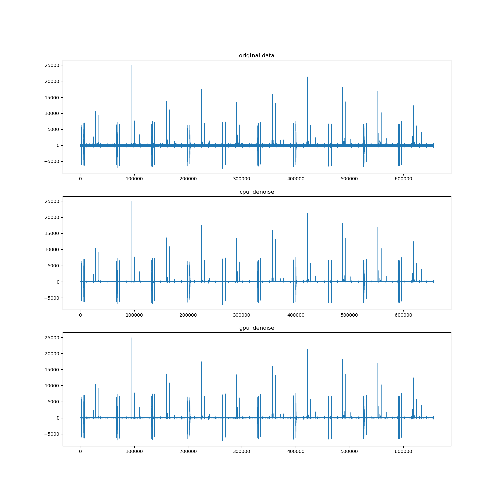

# README

This repository is a python implement of denoising part of the paper[ <i>Improved Peak Detection and Quantification of Mass Spectrometry Data Acquired from Surface-Enhanced Laser Desorption and Ionization by Denoising Spectra with the Undecimated Discrete Wavelet Transform</i>](https://odin.mdacc.tmc.edu/~jmorris/papers_files/denoisingSpectra-10feb04.pdf). Notice that SWT and UDWT are <b>Synonyms</b> by [wiki](https://en.wikipedia.org/wiki/Stationary_wavelet_transform#Synonyms).

## Some explanations of  the code details

`thresh_coe=10`: 

the paper said `We concluded that setting the threshold at 10 is likely to give accurate smoothing without overfitting
spurious features of the data.`

`thresh_coe *= 0.67`:

the paper said `expressed as a multiple of 0.67 MAD in the RWT implementation`

`w = pywt.Wavelet('db8')`: 

the paper said `We selected a Daubechies wavelet of degree 8 for all further analysis. `

`mad = stats.median_absolute_deviation(coeffs[i][1])`:

the paper said ` Next, we compute the median absolute deviation (MAD) of the wavelet coefficients, which yields a robust estimate of their variability. We then set to zero all coefficients below some threshold (expressed as a multiple of 0.67 MAD in the RWT implementation), and transform back to the time domain. `

`d_i = pywt.threshold(coeffs[i][1], thresh_coe * mad, 'hard')`:

the paper said ` When using the UDWT, it has previously been observed that hard thresholding simultaneously retains good smoothness properties and good l2 performance (Lang et al., 1995). By visual inspection of several samples, we confirmed that hard thresholding retained more of the true peak shape than soft thresholding in our spectra (data not shown). `

## Test

Go to this dir and run `python denoise.py`

If you want to use GPU to accelerate your computation, you need to install [`pypwt`](https://github.com/pierrepaleo/pypwt).

The result wave would be stored in `./data_and_res/result.png` just as below.

